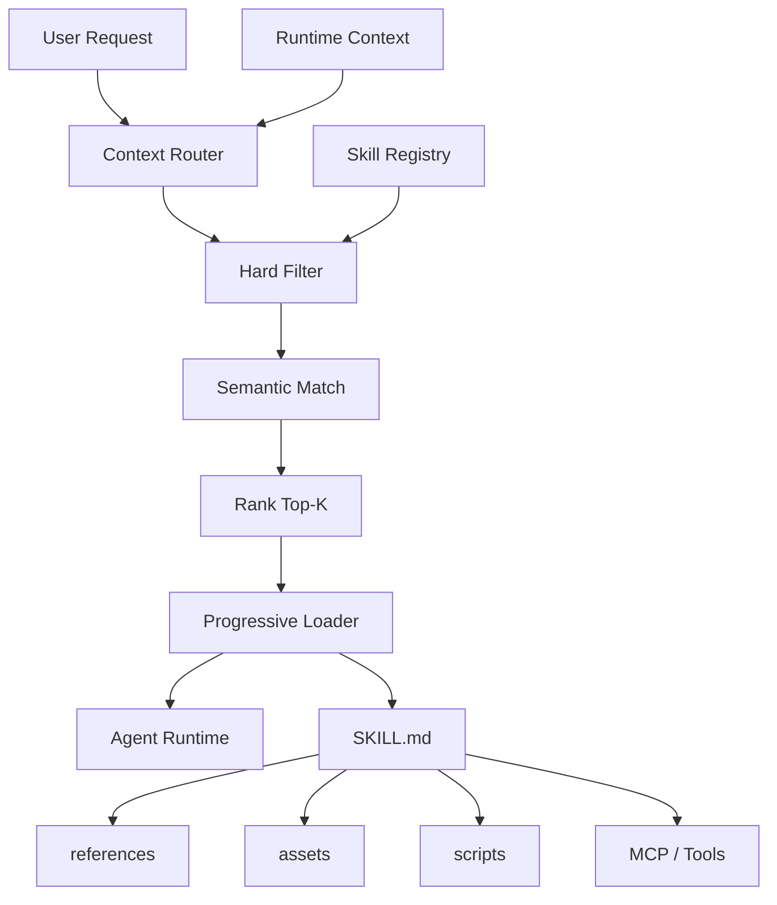
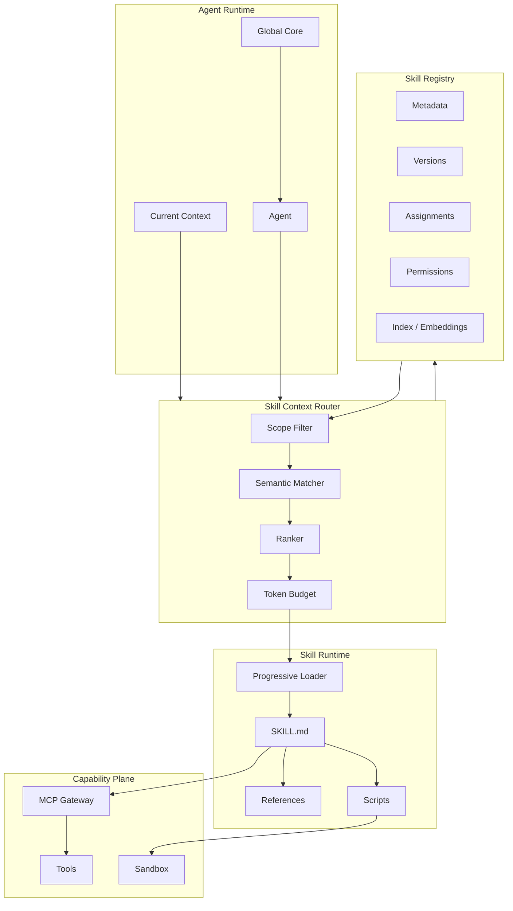

# Agent 分层 Skill 管理与按场景动态加载方案

> 目标：解决本地 Skill 平铺管理导致的 **Token 浪费、场景污染、Agent 能力边界不清、Skill 发现困难、权限失控**，建立一套可生产落地的 **Skill Registry + Scope + Router + Progressive Loading** 架构。

---

## 1. 结论先行

不建议继续采用：

```text
skills/
├── react.md
├── python.md
├── docker.md
├── kubernetes.md
├── finance.md
├── research.md
├── code-review.md
├── browser.md
├── ... 500+ skills
```

也不建议让 Agent 启动时把所有 `SKILL.md` 全部注入 Context。

推荐采用：

```text
Global Core
    ↓
Agent Scope
    ↓
Project Scope
    ↓
Scene / Task Scope
    ↓
Skill Registry
    ↓
Candidate Ranking
    ↓
Top-K Skills
    ↓
Progressive Loading
    ↓
SKILL.md
    ↓
References / Assets / Scripts / MCP
```

核心原则：

> **全局只保留基础能力与 Skill Discovery，不保留大量具体业务 Skill。具体 Skill 只在进入对应 Agent / Project / Scene / Task 后动态加载。**

推荐最终采用 **Agent Skills Open Format (`SKILL.md`) 作为 Skill 内容标准**，参考 Microsoft Agent Framework 的多来源 Skill Provider 与 Progressive Disclosure；借鉴 OpenWork 的组织/分发思路、MCPHub 和 Microsoft MCP Gateway 的能力网关思路、Archestra 的权限/Registry/可观测性设计，并由你自己的轻量 `Skill Router` 做最终场景匹配。

---

## 2. 要解决的问题

### 2.1 Skill 平铺最大的三个问题

#### 问题 A：Context 污染

如果有 300 个 Skill，每个只占 80~150 tokens 的描述：

```text
300 × 100 tokens = 30,000 tokens
```

即使 Skill 正文没有全部加载，仅 metadata 过多也会影响模型判断、系统 Prompt 长度和路由质量。

真正的问题不是“Skill 文件太多”，而是：

> **无关能力被放进了当前任务的候选空间。**

#### 问题 B：场景不隔离

例如一个 Agent 同时拥有：

```text
frontend
backend
finance
research
docker
game
legal
marketing
...
```

用户只是要求：

> 修改一个 React 组件。

却让 Agent 同时面对几十甚至几百个能力入口。

#### 问题 C：Skill 与 Agent / Project 没有关系

相同的 `docker` Skill：

- Web 项目需要的用法不同
- ML 项目需要的用法不同
- Raspberry Pi 项目需要的用法不同
- Production DevOps Agent 又不同

所以 Skill 不能只有：

```text
Skill = docker
```

应该至少有：

```text
Skill = capability + scope + scene + constraints
```

---

# 3. 目标架构

推荐架构：



---

# 4. 五层 Skill 模型

## Layer 0：Global Core

始终存在，尽量控制在极小规模。

只包含：

```text
identity
reasoning rules
memory rules
tool discovery
skill discovery
project context rules
security / permission rules
```

不包含：

```text
具体业务知识
具体框架细节
全部项目文档
所有 Skill 正文
所有工具定义
```

---

## Layer 1：Agent Scope

每个 Agent 定义允许使用的 Skill Domain。

例如：

```yaml
agent:
  id: developer
  domains:
    - development
    - debugging
    - architecture
```

Research Agent：

```yaml
agent:
  id: researcher
  domains:
    - research
    - web
    - analysis
```

这样可以在语义检索以前进行一次硬过滤。

---

## Layer 2：Project Scope

项目决定技术栈、目录结构、运行环境和允许场景。

例如：

```yaml
project:
  id: hermes
  type: agent-system
  stack:
    - python
    - node
    - raspberry-pi
    - mcp
  domains:
    - agent
    - memory
    - vision
    - edge
```

不符合 Project Scope 的 Skill 不进入候选集合。

---

## Layer 3：Scene / Task Scope

这是整个方案最重要的一层。

例如：

```yaml
scene:
  id: code-debugging
  intents:
    - diagnose
    - debug
    - trace
```

用户说：

> Hermes 启动后为什么越来越慢？

推断：

```text
agent = developer
project = hermes
scene = debugging
intent = performance-analysis
```

然后只检索：

```text
agent/*
project:hermes/*
scene:debugging/*
```

而不是整个 Skill Universe。

---

## Layer 4：Skill Runtime

最终命中的 Skill 才进入运行时。

```text
Metadata
   ↓
SKILL.md
   ↓
references
   ↓
assets
   ↓
scripts
   ↓
MCP / tools
```

---

# 5. Skill 不应该只是一个 Markdown 文件

推荐模型：

```text
Skill
├── Metadata
├── Instructions
├── References
├── Assets
├── Scripts
├── Tools / MCP
├── Permissions
├── Compatibility
└── Version
```

标准目录：

```text
react-code-review/
├── SKILL.md
├── references/
│   ├── architecture.md
│   ├── performance.md
│   └── accessibility.md
├── scripts/
│   ├── eslint-check.js
│   └── dependency-analysis.js
└── assets/
    └── report-template.md
```

Agent Skills 官方规范要求 Skill 至少包含一个 `SKILL.md`，并支持 `scripts/`、`references/`、`assets/`；官方推荐通过渐进式披露减少上下文使用。参考：

- https://agentskills.io/
- https://agentskills.io/specification
- https://github.com/agentskills/agentskills

---

# 6. Progressive Disclosure

这是整个方案控制 Token 的核心机制。

## Level 0：Advertise

只暴露：

```text
name
+
description
```

例如：

```text
react-code-review
Review React code for architecture, performance and maintainability.
```

不加载全文。

Agent Skills / Microsoft 文档建议这一层约 100 tokens/Skill，完整 `SKILL.md` 推荐控制在 5000 tokens 以下，并按需再读取 Resource 与 Script。

参考：

- https://github.com/agentskills/agentskills/blob/main/docs/specification.mdx
- https://github.com/microsoft/agent-framework/blob/main/docs/decisions/0037-agent-skills-design.md

---

## Level 1：Load Skill

命中后才：

```text
load_skill("react-code-review")
```

得到完整 Skill instructions。

---

## Level 2：Read Resource

如果还需要：

```text
read_skill_resource(
  "react-code-review",
  "performance.md"
)
```

只读取对应 reference。

---

## Level 3：Run Script

最终需要执行的时候：

```text
run_skill_script(
  "react-code-review",
  "eslint-check.js"
)
```

这一设计正是 Microsoft Agent Framework Skill 架构当前采用的核心模式：`load_skill`、`read_skill_resource`、`run_skill_script`。

---

# 7. Skill Registry

不要让 Agent 直接扫描文件系统。

建立一个统一 Registry：

```text
Skill Registry
├── metadata
├── scope
├── tags
├── dependencies
├── permissions
├── compatibility
├── versions
├── popularity
├── quality
└── location
```

推荐 Metadata：

```yaml
id: react-code-review
name: React Code Review
version: 1.2.0
specVersion: agentskills/v1

description: >-
  Review React code for architecture, performance,
  accessibility and maintainability.

agentScopes:
  - developer
  - reviewer

domains:
  - development.frontend

scenes:
  - coding
  - review
  - refactoring

intents:
  - code-review
  - performance-review

technologies:
  - react
  - typescript

projectTypes:
  - web

requires:
  - node

optionalTools:
  - eslint

permissions:
  filesystem: read
  shell: restricted
```

---

# 8. Skill Router

Router 不应该只做向量搜索。

推荐：

```text
Hard Filter
    ↓
Metadata Match
    ↓
Semantic Match
    ↓
Context Score
    ↓
Quality Score
    ↓
Top-K
```

评分模型建议：

```text
score =
    0.30 × intent_match
  + 0.20 × scene_match
  + 0.15 × agent_match
  + 0.15 × project_match
  + 0.10 × technology_match
  + 0.05 × semantic_similarity
  + 0.05 × skill_quality
```

生产环境可以动态调整权重。

---

# 9. 两阶段检索比纯 Vector Search 更好

不要：

```text
500 skills
   ↓
Embedding
   ↓
Top 10
```

推荐：

```text
500 skills
   ↓
Agent Scope
   ↓
Project Scope
   ↓
Scene Scope
   ↓
100 candidates
   ↓
Semantic Search
   ↓
20 candidates
   ↓
Ranking
   ↓
3~5 active skills
```

原因：

- 更稳定
- 更少误匹配
- 更少向量搜索数据
- 更低计算成本
- 更容易做权限控制
- 更容易解释为什么加载某个 Skill

---

# 10. Skill Scope 设计

推荐 Scope 优先级：

```text
Global
  ↓
Organization
  ↓
Team
  ↓
Agent
  ↓
Project
  ↓
Scene
  ↓
Task
  ↓
Session
```

最终有效 Skill：

```text
EffectiveSkills =
  Global
  ∩ AgentAllowed
  ∩ ProjectAllowed
  ∩ SceneAllowed
  ∩ PermissionAllowed
```

然后再进入 semantic ranking。

---

# 11. Skill 分组

推荐按照能力域组织，而不是按照技术名字平铺。

```text
skills/
├── development/
│   ├── frontend/
│   ├── backend/
│   ├── database/
│   ├── testing/
│   └── devops/
│
├── project/
│   ├── architecture/
│   ├── requirements/
│   ├── code-analysis/
│   └── documentation/
│
├── research/
│   ├── web-research/
│   ├── paper-analysis/
│   └── competitor-analysis/
│
├── operations/
│   ├── debugging/
│   ├── deployment/
│   └── monitoring/
│
└── domain/
    ├── finance/
    ├── legal/
    └── game-development/
```

注意：目录只是物理组织方式。

真正的匹配依据应该来自 Registry Metadata。

---

# 12. 推荐加入 Scene Preset

场景应该是可复用的一等对象。

例如：

```yaml
scene:
  id: project-code-analysis

  agents:
    - architect
    - developer

  defaultSkills:
    - project-understanding
    - code-search
    - architecture-analysis

  optionalSkills:
    - codegraph
    - code-graph-rag

  maxActiveSkills: 5
```

这样一个 Project 进入：

```text
Code Analysis Scene
```

不需要重新从 500 个 Skill 里面找一遍。

---

# 13. Skill Bundle

进一步可以创建 Bundle：

```yaml
bundle:
  id: frontend-development
  description: Frontend development capability bundle

  skills:
    - react
    - typescript
    - frontend-architecture
    - testing
    - accessibility
```

但 Bundle 不能直接全部加载。

Bundle 只是一层候选范围：

```text
Bundle
  ↓
Skill Router
  ↓
Selected Skills
```

---

# 14. Agent 与 Skill 的关系

不推荐：

```text
Agent
  ↓
500 Skills
```

推荐：

```text
Agent
  ↓
Allowed Domains
  ↓
Skill Registry
  ↓
Scene
  ↓
Top-K
```

例如：

```yaml
agent:
  id: architect

  allowedDomains:
    - project
    - architecture
    - code-analysis
    - infrastructure

  deniedDomains:
    - finance
    - marketing
```

---

# 15. Project 与 Skill 的关系

项目应该拥有一个 Project Manifest：

```yaml
project:
  id: hermes
  repo: github.com/example/hermes

  type: agent-system

  stack:
    language:
      - python
      - typescript
    runtime:
      - node
      - linux
    protocol:
      - mcp

  scenes:
    - development
    - debugging
    - architecture
    - deployment
```

Skill Router 根据 Project Manifest 做硬过滤。

这样 `ios-swiftui` Skill 不会因为 embedding 相似就错误进入 Hermes Agent 的候选池。

---

# 16. MCP 不要和 Skill 混为一谈

这是整个架构非常重要的边界：

```text
Skill = 怎么做
MCP Tool = 能做什么
Memory = 以前发生过什么
Knowledge = 项目知道什么
Code Graph = 代码结构是什么
```

例如：

```text
Skill: postgres-debugging
       ↓
Instructions
       ↓
MCP: postgres
       ↓
execute SQL
```

所以推荐：

```text
Skill Registry
        │
        ├── instructions
        ├── references
        ├── scripts
        └── required MCP / Tools
```

---

# 17. MCP Gateway 层

如果 Skill 需要很多 MCP，不要让每个 Agent 都直接连接几十个 MCP Server。

推荐：

```text
Agent
  ↓
MCP Gateway
  ↓
Tool Registry
  ↓
Relevant MCP Servers
```

这就是 Microsoft MCP Gateway、MCPHub、Archestra 值得借鉴的地方。

---

# 18. MCP 与 Skill 的动态加载

例如用户要求：

> 查询生产数据库并分析慢 SQL

Router：

```text
Scene = database-debugging
Skill = postgres-performance
```

Skill Metadata：

```yaml
requiresTools:
  - postgres.query
  - postgres.explain
```

然后 MCP Gateway 只暴露：

```text
postgres.query
postgres.explain
```

而不是：

```text
200 MCP tools
```

这与 OpenAI Agents SDK 当前支持的 Tool Search / deferred tools 思路也一致：大型工具面不必全部立即注入，可以延迟到运行时再发现。参考：

https://openai.github.io/openai-agents-python/tools/

---

# 19. 借鉴项目一览

| 项目 | 最值得借鉴的部分 | 是否建议直接作为核心 |
|---|---|---|
| Agent Skills / agentskills | Skill 标准、SKILL.md、Progressive Disclosure | **是，作为格式标准** |
| Microsoft Agent Framework | 多来源 Skill Provider、Filtering、Caching、Dynamic Loading | **是，作为架构参考** |
| OpenAI Agents SDK | Agent Runtime、动态工具、Agents as Tools、Handoff | 可选，作为 Runtime 参考 |
| OpenWork | Skill / Plugin / MCP 统一能力分发、团队/用户分配 | **强参考** |
| MCPHub | MCP Registry、分组、Smart Routing、Tool 压缩、Web 控制面 | **强参考** |
| Microsoft MCP Gateway | MCP Control Plane、Tool Registry、授权、动态路由 | **生产参考** |
| Archestra | 企业级 Registry、RBAC、MCP Gateway、Agent、Skill、Observability | **生产级参考** |

---

# 20. 项目 1：Agent Skills Open Standard

## 地址

- 官网： https://agentskills.io/
- Specification： https://agentskills.io/specification
- GitHub： https://github.com/agentskills/agentskills
- Anthropic Skill Repository： https://github.com/anthropics/skills

## 值得借鉴

这是整个方案的 **Skill 文件格式基础**。

定义了：

```text
SKILL.md
scripts/
references/
assets/
```

以及：

```text
metadata
→ instructions
→ resources
```

渐进式加载。

## 结论

不要自己再发明一个新的 Skill Markdown 标准。

直接兼容 Agent Skills Specification。

---

# 21. 项目 2：Microsoft Agent Framework

## 地址

https://github.com/microsoft/agent-framework/

## 官方 Skill Design

https://github.com/microsoft/agent-framework/blob/main/docs/decisions/0037-agent-skills-design.md

## 最值得借鉴的设计

Microsoft 当前的设计把 Skill 抽象成：

```text
AgentSkill
AgentSkillResource
AgentSkillScript
AgentSkillsSource
```

并支持：

```text
File Skills
Inline Skills
Class Skills
Aggregating Sources
Filtering Sources
Caching Sources
Deduplicating Sources
```

这对你的系统尤其重要。

因为这意味着 Skill Source 可以不是文件系统。

未来可以：

```text
Filesystem
Git
Database
REST API
Package Registry
Remote Registry
```

统一成为 Skill Source。

## 重点借鉴

```text
AgentSkillsSource
        ↓
Filtering
        ↓
Caching
        ↓
Aggregation
        ↓
Agent
```

这几乎可以直接作为你的 Skill Registry 的架构参考。

---

# 22. 项目 3：OpenAI Agents SDK

## 地址

https://github.com/openai/openai-agents-python

## 文档

https://openai.github.io/openai-agents-python/

## 借鉴点

OpenAI Agents SDK 当前提供：

- Agent
- Tools
- Agents as Tools
- Handoffs
- Guardrails
- Sessions
- Tracing
- Sandbox Agents
- MCP integration
- Tool Search / deferred tools

特别值得借鉴的是：

```text
Manager Agent
       ↓
Specialist Agent
```

和：

```text
Agent
  ↓
Tool Search
  ↓
Load required capability
```

这可以作为 Skill Router 上层 Agent Orchestration 的参考。

---

# 23. 项目 4：Microsoft MCP Gateway

## 地址

https://github.com/microsoft/mcp-gateway

## 借鉴点

Microsoft MCP Gateway 的结构很值得作为生产参考：

```text
Control Plane
    ├── Adapter Management
    ├── Tool Management
    └── Metadata Management

Data Plane
    ├── Adapter Routing
    └── Tool Gateway Router
```

同时包含：

- MCP Server 生命周期管理
- Tool Registry
- 动态 Tool Routing
- Session-aware routing
- Authorization
- Observability
- Kubernetes deployment

## 应用到你的系统

可以改造为：

```text
Skill Control Plane
    ├── Skill Registry
    ├── Skill Version
    ├── Skill Permission
    ├── Skill Assignment
    └── Skill Metadata

Capability Data Plane
    ├── Skill Loader
    ├── MCP Gateway
    ├── Tool Router
    └── Script Runner
```

---

# 24. 项目 5：MCPHub

## 地址

https://github.com/samanhappy/mcphub

## 中文 README

https://github.com/samanhappy/mcphub/blob/main/README.zh.md

## 官网

https://www.mcphub.app/zh

## 最值得借鉴

MCPHub 已经包含很多你需要的能力：

```text
Server / Group
Visibility
Tool / Prompt / Resource Exposure
Smart Routing
Vector Search
CLI
Web Console
Logs
Health Checks
Authentication
```

特别是：

```text
/mcp
/mcp/{group}
/mcp/{server}
/mcp/$smart
/mcp/$smart/{group}
```

这个模式非常适合扩展成：

```text
/skills
/skills/{domain}
/skills/{agent}
/skills/{project}
/skills/$smart
```

但建议不要把 Skill Router 完全变成 MCPHub 的 Vector Router。

还是应该先进行 Scope Filter，再做 semantic matching。

---

# 25. 项目 6：OpenWork

## 地址

https://github.com/different-ai/openwork

## 文档

https://openworklabs.com/docs

## 最值得借鉴

OpenWork 非常接近：

> “不同 Agent 客户端共享能力，但是不希望所有能力都由每个 Agent 自己管理。”

它的模式是：

```text
Agent
  ↓
OpenWork MCP
  ↓
search_capabilities
  ↓
execute_capability
```

同时支持：

- Skills
- Plugins
- MCP
- Google Workspace
- Microsoft 365
- team / organization assignment
- marketplace

其组织控制平面还支持将 Skill / Plugin 分配给：

```text
Organization
Team
User
```

## 对你最有价值的地方

可以借鉴：

```text
Skill Marketplace
Skill Assignment
Team Scope
User Scope
Capability Search
Capability Execution
```

最终：

```text
Skill Registry
      ↓
Assignment
      ↓
Router
      ↓
Agent
```

---

# 26. 项目 7：Archestra

## 地址

https://github.com/archestra-ai/archestra

## 官网

https://archestra.ai/

## 最值得借鉴

Archestra 是这几个项目中最偏生产平台的一类，可以借鉴：

```text
Private MCP Registry
MCP Gateway
Agent Runtime
Reusable Skills
RBAC
SSO
Secrets Management
Guardrails
Observability
Kubernetes
Environments
Cost Controls
```

尤其是它的：

```text
Private MCP Registry
+
Agent Skills Sharing
+
RBAC
+
Environment
+
Observability
```

非常适合以后把你的 Skill System 做成团队基础设施。

## 注意

Archestra 是一个完整 AI Platform，不适合直接作为你现在 Skill Manager 的全部基础。

更适合：

> 借鉴其生产平台边界，而不是直接引入整套平台。

---

# 27. 推荐的技术组合

最终推荐：

```text
                   Agent Runtime
                         │
                ┌────────┴────────┐
                │                 │
            Global Core        Memory
                │                 │
                └────────┬────────┘
                         ↓
                   Context Router
                         │
              ┌──────────┼───────────┐
              ↓          ↓           ↓
           Agent      Project       Scene
              │          │           │
              └──────────┼───────────┘
                         ↓
                  Skill Registry
                         │
              ┌──────────┼───────────┐
              ↓          ↓           ↓
            Scope      Metadata    Permission
             Filter
              │
              ↓
          Semantic Search
              │
              ↓
             Rank
              │
              ↓
            Top-K
              │
              ↓
       Progressive Loader
              │
        ┌─────┼─────┐
        ↓     ↓     ↓
     SKILL  REF   SCRIPT
              │
              ↓
          Tool / MCP
              │
              ↓
           Execution
```

---

# 28. 推荐组件职责

| 组件 | 职责 | 推荐技术 |
|---|---|---|
| Skill Spec | Skill 内容格式 | Agent Skills spec |
| Skill Registry | Skill Metadata / Version / Scope | PostgreSQL / SQLite + JSON |
| Skill Index | 语义检索 | pgvector / SQLite FTS + embeddings |
| Skill Router | 场景匹配 | Node / Python |
| Loader | Progressive Loading | Node / Python |
| MCP Gateway | Tool 路由 | MCPHub / Microsoft MCP Gateway |
| Runtime | Agent 执行 | 现有 Agent Runtime / OpenAI Agents SDK / MAF |
| Policy | Permission | RBAC / Policy Engine |
| Observability | Skill hit / token / latency | OpenTelemetry |

---

# 29. 存储方案

如果希望简单，不需要一开始上独立向量数据库。

推荐：

```text
PostgreSQL
├── skills
├── skill_versions
├── skill_scopes
├── skill_dependencies
├── skill_assignments
├── skill_usage
└── skill_embeddings
```

使用：

```text
PostgreSQL
+
pgvector
```

已经足够。

更小规模则：

```text
SQLite
+
FTS5
```

第一阶段甚至可以：

```text
JSON Registry
+
filesystem
```

然后以后升级到 PostgreSQL。

---

# 30. Skill Registry Schema

示例：

```sql
CREATE TABLE skills (
  id TEXT PRIMARY KEY,
  name TEXT NOT NULL,
  description TEXT NOT NULL,
  version TEXT NOT NULL,
  path TEXT NOT NULL,
  status TEXT NOT NULL,
  compatibility JSONB,
  metadata JSONB,
  created_at TIMESTAMP,
  updated_at TIMESTAMP
);
```

Scope：

```sql
CREATE TABLE skill_scopes (
  skill_id TEXT,
  scope_type TEXT,
  scope_id TEXT,
  effect TEXT
);
```

例如：

```text
skill: react-review
scope_type: agent
scope_id: developer
effect: allow
```

---

# 31. Skill Assignment

建议支持：

```text
Global
Organization
Team
Agent
Project
User
Session
```

例如：

```yaml
assignments:
  - scope: organization
    id: engineering

  - scope: agent
    id: architect

  - scope: project
    id: hermes
```

最终 Router 合并这些范围。

---

# 32. Skill Dependency

Skill 可以依赖其他 Skill：

```yaml
requires:
  - project-understanding
  - code-search
```

但依赖也不要全部立即加载。

只需要把依赖关系作为 Registry metadata：

```text
Skill A
  ↓
requires B
```

只有真正调用 A 时才判断是否加载 B。

---

# 33. Skill Conflict

增加冲突关系：

```yaml
conflicts:
  - aws-deployment
  - local-deployment
```

Router 做：

```text
candidate skills
    ↓
conflict resolution
    ↓
final active set
```

避免一次加载互相矛盾的流程。

---

# 34. Skill Priority

建议：

```yaml
priority: 80
```

一般：

```text
0-30    low
30-60   normal
60-80   high
80-100  critical
```

但 Priority 只能参与排名，不应该绕过 Scope / Permission。

---

# 35. Skill Quality Score

长期运行后可以记录：

```text
skill_hit_count
skill_success_rate
skill_failure_rate
avg_tokens
avg_latency
user_feedback
agent_feedback
```

然后得到：

```text
skill_quality_score
```

用于 Router 排名。

例如：

```text
react-review-v1  0.74
react-review-v2  0.92
```

可以自动提高 v2 被选中的概率。

---

# 36. Skill Router API

建议第一版只需要：

```http
GET /skills
GET /skills/:id
POST /skills/discover
POST /skills/load
POST /skills/resource
POST /skills/script
```

Discover：

```json
{
  "agent": "developer",
  "project": "hermes",
  "scene": "debugging",
  "intent": "startup-performance",
  "query": "为什么启动越来越慢"
}
```

返回：

```json
{
  "skills": [
    {
      "id": "node-debugging",
      "score": 0.94
    },
    {
      "id": "performance-analysis",
      "score": 0.90
    }
  ]
}
```

---

# 37. Agent Tool Surface

不要给 Agent：

```text
load_500_skills
```

推荐只给三个基础能力：

```text
search_skills
load_skill
read_skill_resource
```

如果项目存在 executable scripts，再动态增加：

```text
run_skill_script
```

这一点与 Microsoft Agent Framework 的设计高度一致。

---

# 38. Global Prompt 最终应该变成什么

不要：

```text
You have these 200 skills...
```

推荐：

```text
You have access to a skill registry.

Use search_skills when specialized knowledge may be required.
Only load a skill when it is relevant to the current task.
Read skill resources only when needed.
Do not load unrelated skills.
```

然后只由 Router 注入当前有效的少量 metadata。

---

# 39. 一个实际运行流程

用户：

> 分析 Hermes 为什么最近启动时间越来越长。

## Step 1：Global Core

Agent 获得：

```text
memory
reasoning
tool discovery
skill discovery
```

## Step 2：Context

得到：

```text
agent = developer
project = hermes
scene = debugging
intent = performance
```

## Step 3：Hard Filter

从 500 Skills：

```text
500
 ↓
agent scope
 ↓
180
 ↓
project scope
 ↓
65
 ↓
scene scope
 ↓
18
```

## Step 4：Semantic Search

```text
18
 ↓
8
```

## Step 5：Rank

```text
node-performance      0.94
python-profiling      0.90
startup-debugging     0.88
code-analysis         0.80
```

## Step 6：Activate

最终只加载：

```text
node-performance
python-profiling
startup-debugging
```

## Step 7：需要进一步资料

只读取：

```text
python-profiling/references/startup.md
```

## Step 8：需要执行

执行：

```text
python-profiling/scripts/profile.py
```

整个过程中，其余数百 Skill 完全不进入 Context。

---

# 40. 与 Memory / Project Knowledge 的关系

建议最终 Agent Knowledge Layer 分成四种：

```text
                Agent Knowledge Layer
                         │
       ┌─────────────────┼──────────────────┐
       ↓                 ↓                  ↓
    Memory            Knowledge            Skills
       │                 │                  │
what happened      what is known      how to do
       │                 │                  │
       └─────────────────┼──────────────────┘
                         ↓
                      Tools
                   what can execute
```

再加 CodeGraph：

```text
CodeGraph = code structure
Memory    = historical events
Knowledge = project facts
Skill     = procedures
MCP       = executable capabilities
```

这五个东西不要混成一个 Vector DB。

---

# 41. 与 CodeGraph / code-graph-rag 的配合

在你目前的项目知识体系中，建议：

```text
Skill
  ↓
告诉 Agent 怎么分析项目

CodeGraph
  ↓
告诉 Agent 代码关系是什么

Project Knowledge
  ↓
告诉 Agent 项目业务背景

Memory
  ↓
告诉 Agent 过去做过什么
```

例如：

```text
Skill: architecture-analysis
       ↓
调用 codegraph
       ↓
找到入口
       ↓
找到调用链
       ↓
读取相关代码
       ↓
结合 project knowledge
       ↓
输出结论
```

这样 Skill 本身可以保持很小。

---

# 42. Skill Token Budget

建议建立硬性预算。

```yaml
runtime:
  maxActiveSkills: 5
  maxSkillInstructionsTokens: 8000
  maxReferenceTokens: 12000
  maxToolDefinitions: 15
```

推荐原则：

```text
Skill Metadata       very small
SKILL.md             small
Reference            on demand
Tool                 on demand
Large document       external retrieval
```

不要因为 Skill Router 找到了 10 个 Skill，就全部加载。

---

# 43. Cache

Skill Loader 可以做三级缓存：

```text
L1 process memory
L2 local disk
L3 registry / git
```

例如：

```text
load_skill(skillId, version)
```

如果本地已经存在：

```text
memory cache
```

无需再次读取 Git / DB。

Microsoft Agent Framework 的设计中也明确包含 Caching / Aggregating / Filtering skill source，可直接参考其 provider abstraction。

---

# 44. Version 管理

Skill 必须版本化：

```text
react-review@1.2.0
react-review@1.3.0
```

项目可以锁版本：

```yaml
skills:
  react-review: 1.2.x
```

生产环境不要无条件：

```text
latest
```

---

# 45. Git 管理方式

推荐 Skill 本身使用 Git 管理：

```text
skills-repo/
├── development/
├── research/
├── project/
├── operations/
└── domain/
```

Registry 只保存 Metadata：

```text
Git
 ↓
Indexer
 ↓
Registry
```

Skill 内容仍然来自 Git。

这样天然获得：

- version
- diff
- review
- rollback
- ownership
- release

---

# 46. Skill 发布流程

推荐：

```text
Developer
   ↓
Create Skill
   ↓
skills-ref validate
   ↓
Git PR
   ↓
Review
   ↓
CI
   ↓
Registry Index
   ↓
Available
```

Agent Skills specification 提供了用于验证 Skill 的 `skills-ref` 路径/工具链思路，可作为 CI 校验参考。

---

# 47. Permission Model

Skill 不应该天然拥有所有 Tool 权限。

推荐：

```yaml
permissions:
  filesystem:
    read: true
    write: false

  shell:
    enabled: false

  network:
    enabled: false
```

Skill 所需 MCP：

```yaml
tools:
  - git.read
  - postgres.query
```

然后经过 Agent / Project / User policy 再决定是否允许。

---

# 48. Security Boundary

尤其注意：

```text
Skill Markdown
≠ Trusted Code
```

Skill 可能包含：

```text
scripts
shell
network
MCP
```

因此：

```text
Skill metadata
   ↓
Policy
   ↓
Approval
   ↓
Sandbox
   ↓
Execution
```

Archestra 在 sandboxed execution、RBAC、secrets、guardrails 方面的设计值得参考。

---

# 49. Observability

每一次 Skill 使用都记录：

```json
{
  "skill": "react-code-review",
  "version": "1.2.0",
  "agent": "developer",
  "project": "hermes",
  "scene": "review",
  "selected": true,
  "loaded": true,
  "reference_reads": 2,
  "script_calls": 1,
  "input_tokens": 1200,
  "output_tokens": 2400,
  "latency_ms": 840,
  "success": true
}
```

这样可以真正测出：

```text
Token saved
Skill hit rate
False positive rate
Skill success rate
Routing latency
```

---

# 50. 最重要的指标

不要只看 Skill 数量。

真正需要监控：

### Context Efficiency

```text
Active Skill Tokens / Total Skill Tokens
```

越低越好。

### Skill Precision

```text
Relevant Skills / Activated Skills
```

越高越好。

### Skill Recall

```text
Relevant Skills Found / Relevant Skills Existing
```

不能为了省 Token 而完全找不到正确 Skill。

### Router Overhead

```text
router latency
embedding latency
registry latency
```

### Task Success

```text
Skill Activated → Task Success
```

最终需要证明：

> 少加载 Skill 并没有降低任务成功率。

---

# 51. 推荐的第一版技术栈

为了简单，不建议第一阶段引入一个巨大平台。

推荐：

```text
Runtime:
  Node.js / TypeScript

Skill format:
  Agent Skills SKILL.md

Registry:
  PostgreSQL

Vector:
  pgvector

Search:
  metadata filter + FTS + vector

Cache:
  Redis（可选）

MCP:
  MCPHub 或 Microsoft MCP Gateway

Observability:
  OpenTelemetry

Execution:
  local sandbox / container
```

如果单机开发：

```text
Node.js
+
SQLite
+
FTS5
+
filesystem
```

已经可以跑起来。

---

# 52. 推荐项目目录

```text
agent-runtime/
├── core/
│   ├── system-prompt/
│   ├── memory/
│   └── tools/
│
├── skill-registry/
│   ├── indexer/
│   ├── metadata/
│   ├── search/
│   ├── router/
│   └── loader/
│
├── skills/
│   ├── development/
│   ├── project/
│   ├── research/
│   ├── operations/
│   └── domain/
│
├── scenes/
│   ├── coding.yaml
│   ├── debugging.yaml
│   ├── research.yaml
│   └── architecture.yaml
│
├── agents/
│   ├── developer.yaml
│   ├── researcher.yaml
│   └── architect.yaml
│
├── projects/
│   └── hermes.yaml
│
├── gateway/
│   ├── mcp/
│   └── tools/
│
└── observability/
```

---

# 53. Scene Definition 示例

```yaml
id: debugging
name: Debugging

allowedDomains:
  - development
  - code-analysis
  - operations

defaultSkills:
  - debugging-methodology
  - project-context

candidateSkills:
  - python-debugging
  - node-debugging
  - performance-debugging
  - database-debugging

maxActiveSkills: 5
```

---

# 54. Agent Definition 示例

```yaml
id: developer

skills:
  allowDomains:
    - development
    - project
    - operations

  defaultScenes:
    - coding
    - debugging
    - refactoring

  maxActiveSkills: 5
```

---

# 55. 最终 Agent 启动 Context

应该尽可能接近：

```text
System Core
+
Current Project Metadata
+
Current Scene
+
Skill Discovery Tool
```

而不是：

```text
System Core
+
all skills
+
all project docs
+
all tools
+
all MCP
+
all memory
```

---

# 56. 推荐的最佳实践

## 规则 1：Skill Metadata 极小

只表达：

```text
What
When
```

---

## 规则 2：Skill Body 只写执行方法

不要把整个知识库塞进 SKILL.md。

应该：

```text
SKILL.md
   ↓
references/
```

---

## 规则 3：Knowledge 与 Skill 分离

```text
Knowledge = facts
Skill = procedures
```

---

## 规则 4：Skill 与 MCP 分离

```text
Skill = instruction
MCP = capability
```

---

## 规则 5：先 Filter 再 Vector

```text
Scope Filter
 ↓
Semantic Search
```

---

## 规则 6：Top-K 不宜太高

默认：

```text
3~5 active skills
```

复杂任务：

```text
5~8
```

不推荐：

```text
20+
```

---

# 57. 推荐的落地路线

## Phase 1：最小版本

目标：先解决 Token 浪费。

实现：

```text
Agent Skills format
+
Skill Registry JSON
+
Agent Scope
+
Scene Scope
+
load_skill
+
read_skill_resource
```

无需数据库。

---

## Phase 2：Registry

增加：

```text
SQLite/PostgreSQL
FTS
Metadata
Version
Assignment
Permission
```

---

## Phase 3：Semantic Router

增加：

```text
Embedding
pgvector
Semantic Ranking
Usage Ranking
```

---

## Phase 4：MCP Gateway

接入：

```text
MCPHub
```

或：

```text
Microsoft MCP Gateway
```

让 Skill 动态声明工具需求。

---

## Phase 5：生产控制面

增加：

```text
Web Console
Marketplace
RBAC
Audit
Observability
Skill Versioning
Team Assignment
```

这里再参考：

```text
OpenWork
Archestra
```

---

# 58. 不建议直接做的事情

### 不建议 1：自己重新发明 Skill 格式

直接兼容 Agent Skills。

### 不建议 2：一开始就 Vector DB

先 Metadata Filter，再 Vector。

### 不建议 3：Skill 全部启动加载

必须 Progressive Disclosure。

### 不建议 4：Skill = MCP Tool

两者是不同层。

### 不建议 5：引入整个 Archestra

目前目标是 Skill Manager，不是完整 AI Platform。

### 不建议 6：把所有能力都做成 Skill

一些非常机械的能力直接做 Tool/MCP 更合理。

---

# 59. 最终推荐架构



---

# 60. 最终选型

如果目标是：

> **简单、Token 少、可扩展、兼容现有 Agent、以后能走生产环境。**

推荐组合：

```text
                Skill Format
                    │
              Agent Skills
                    │
                    ↓
             Skill Registry
                    │
         ┌──────────┴───────────┐
         ↓                      ↓
   Scope Filtering       Semantic Router
         │                      │
         └──────────┬───────────┘
                    ↓
                 Rank
                    ↓
                 Top-K
                    ↓
          Progressive Loading
                    ↓
                Skill Runtime
                    │
              ┌─────┴─────┐
              ↓           ↓
             MCP        Scripts
              ↓           ↓
          MCP Gateway   Sandbox
```

### 核心参考

```text
Agent Skills
    → Skill 标准

Microsoft Agent Framework
    → Skill Provider / Filter / Cache / Progressive Disclosure

OpenAI Agents SDK
    → Agent Runtime / Tool Search / Handoff / Orchestration

OpenWork
    → Capability Registry / Marketplace / Assignment

MCPHub
    → MCP Group / Smart Routing / Tool Discovery / Tool Compression

Microsoft MCP Gateway
    → Control Plane / Tool Registry / Routing / Authorization

Archestra
    → Enterprise Registry / RBAC / Secrets / Observability / Runtime
```

---

# 61. 最终原则

整个系统最后应该遵循一个非常简单的规则：

```text
Agent 不应该知道所有 Skill。

Agent 只应该知道：

1. 我现在是什么 Agent
2. 我正在什么 Project
3. 我处于什么 Scene
4. 我可以去 Skill Registry 找能力
5. 我现在应该加载哪些 Skill
6. 当前 Skill 需要哪些资源和工具
```

最终从：

```text
500 Skills
↓
全部平铺
↓
Token 浪费
↓
Agent 判断困难
```

变成：

```text
500 Skills
   ↓
Scope
   ↓
50 candidates
   ↓
Semantic Match
   ↓
10 candidates
   ↓
Rank
   ↓
3~5 Skills
   ↓
Progressive Loading
   ↓
必要 Resource / Tool
```

这才是适合大型 Agent 工程的 Skill 管理方式。

---

# 62. 参考链接总表

## Skill Standard

- https://agentskills.io/
- https://agentskills.io/specification
- https://github.com/agentskills/agentskills
- https://github.com/anthropics/skills

## Agent Runtime / Skill Architecture

- https://github.com/microsoft/agent-framework/
- https://github.com/microsoft/agent-framework/blob/main/docs/decisions/0037-agent-skills-design.md
- https://github.com/openai/openai-agents-python
- https://openai.github.io/openai-agents-python/
- https://openai.github.io/openai-agents-python/tools/
- https://openai.github.io/openai-agents-python/multi_agent/

## MCP / Capability Gateway

- https://github.com/microsoft/mcp-gateway
- https://github.com/samanhappy/mcphub
- https://github.com/samanhappy/mcphub/blob/main/README.zh.md
- https://www.mcphub.app/zh

## Capability / Skill Management

- https://github.com/different-ai/openwork
- https://openworklabs.com/docs
- https://github.com/archestra-ai/archestra
- https://archestra.ai/

---

# 63. 推荐最终实现边界

第一版不要做成一个“大而全的 Agent 平台”。

只实现下面 7 个核心模块：

```text
1. Skill Spec Loader
2. Skill Registry
3. Skill Scope Resolver
4. Skill Router
5. Progressive Loader
6. MCP / Tool Adapter
7. Skill Observability
```

其中最核心的是：

```text
Registry
+
Scope Resolver
+
Router
+
Progressive Loader
```

这四个模块解决了当前 Skill 平铺带来的 80% 问题。

---

# 64. 一句话架构定义

> **Skill 是可版本化的能力包，Registry 负责管理能力，Scope 决定“谁能看到”，Router 决定“当前该用什么”，Progressive Loader 决定“什么时候加载多少”，MCP Gateway 决定“最终能执行什么”。**

这套结构可以作为后续整个 Agent 工程的统一 Skill / Tool / Project 管理层，而不需要把所有能力塞进全局 Context。
